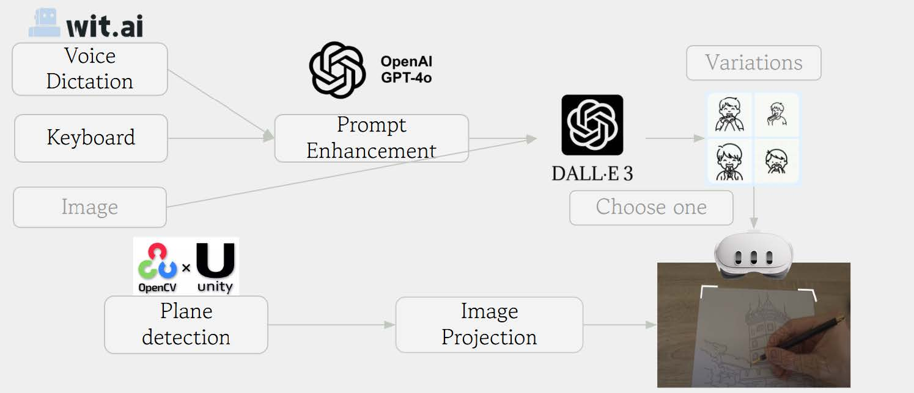

# SketchGenie: AI-Driven AR Drawing Assistant  
**Empowering anyone to create hand-drawn art through voice-to-sketch AI and AR projection**  

  

## Abstract  
SketchGenie is an augmented reality (AR) drawing assistant that bridges the gap between AI-generated art and human creativity. By combining voice-driven AI generation and AR projection, it converts verbal descriptions into traceable line drawings projected onto physical paper. This system enables users without artistic experience to create personalized handmade artwork by tracing AI-generated outlines.  

The current implementation consists of two independent modules:  
- **AI Image Generation**: Voice-to-text → GPT-4 prompt enhancement → DALL·E 3 line art generation.  
- **AR Projection**: Marker-based plane detection → Dynamic projection alignment using OpenCV and Meta Quest 3 passthrough.  

Due to time constraints, full end-to-end integration is incomplete.  

---

## Key Features  
- 🎙️ **Voice-to-Sketch**: Describe your idea aloud → get optimized prompts and traceable line drawings.  
- 🖼️ **AI-Powered Line Art**: High-contrast black-and-white images tailored for manual tracing.  
- 🕶️ **Hands-Free AR Projection**: Overlay sketches onto physical paper using Meta Quest 3.  
- 🧩 **Modular Design**: Independent AI/AR components ready for future integration.  

---

## Technical Overview  
### System Architecture  
```
User Voice → Speech Recognition → GPT-4 Prompt Enhancement → DALL·E 3 Image Generation → AR Projection  
```  
  

### Core Technologies  
| Component         | Technology Stack                          |  
|-------------------|-------------------------------------------|  
| Development       | Unity 2022.4.21f, C#, Python (for demos)   |  
| AR Platform       | Meta Quest 3, OpenXR, Passthrough API      |  
| AI Integration    | OpenAI API (GPT-4o, DALL·E 3)              |  
| Computer Vision   | OpenCV for Unity, ArUco marker detection   |  

---

## Modules  
### 1. AI Module (`demo.py`, `ImageGenManager.cs`)  
- **Speech Recognition**: Uses Meta's speech-to-text building block for real-time transcription.  
- **Prompt Enhancement**: GPT-4o transforms casual descriptions into detailed prompts (e.g., "A boy eating a hot dog" → "[Minimalist line drawing]...").  
- **Image Generation**: DALL·E 3 API generates line art optimized for tracing. Post-processing ensures high contrast and minimal noise.  

Example Enhanced Prompt:  
```text  
"A simple line drawing of a boy eating a hot dog. The boy has a happy expression, with his mouth open as he takes a bite. The drawing is minimalistic, using only black lines on a white background."  
```  

### 2. AR Module (`ImageProjector.cs`, `FrameCapture.cs`)  
- **Marker Detection**: Localizes ArUco markers at paper corners using OpenCV's `solvePnP()` for 3D pose estimation.  
- **Projection Alignment**: Dynamically adjusts virtual planes to match paper orientation (see [video demo]).  
- **Manual Mode**: Marker-free placement for quick setup on flat surfaces.  

Example Pose Calculation:  
```csharp  
Calib3d.solvePnP(objPts, imgPts, intrinsic_mat, distCoeffs, rvec, tvec);  
Pose worldPos = ...; // Compute transformation relative to headset  
paperPlane.transform.SetPositionAndRotation(worldPos, worldRot);  
```  

---

## Dependencies  
- **Unity**: 2022.4+ with XR Interaction Toolkit and Meta SDK.  
- **Python**: For AI module testing (`openai`, `opencv-python`).  
- **API Keys**: OpenAI credentials for GPT-4/DALL·E 3 access.  
- **Hardware**: Meta Quest 3 headset.  

---

## Project Structure  
```  
SketchGenie/  
├── LICENSE                  # MIT License  
├── README.md                # This file  
├── demo.py                  # Python script for AI generation validation  
└── main_scripts/            # Unity C# scripts  
    ├── ImageGenManager.cs   # AI pipeline controller  
    ├── ImageProjector.cs    # AR projection logic  
    └── ...  
└── media/                   # Media assets  
    └── demo_video.mp4       # Demonstration of projection workflow  
```  

---

## Challenges & Lessons Learned  
- **Latency**: Image generation (7–12s) and projection (~1.4s) dominate total runtime.  
- **Projection Accuracy**: Lacking Meta Quest 3 camera distortion coefficients forced use of zero-matrix approximation. Manual offsets were added to compensate.  
- **Deployment Complexity**: Migrating Python scripts to Unity/C# required extensive refactoring due to platform limitations.  

---

## Future Work  
1. Full AI-AR integration.  
2. Optimize latency with caching or lightweight image generators.  
3. Improve marker occlusion handling during user interaction.  

---

## Team
Yuchen Lu, Runqiu Wang, Hudson Hall 

---

## License  
MIT License. See [LICENSE](LICENSE) for details.  
